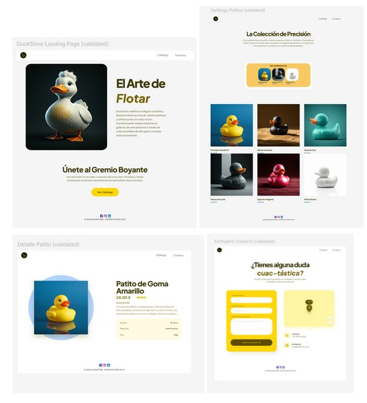
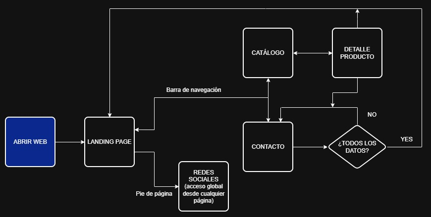

### Descripción
Creación de una página web de una tienda de patitos (DuckStore).
Es un proyecto desarrollado con metodología SCRUM que abarca todo el proceso de producción:
- Diseño y creación de wireframes de baja fidelidad y prototypes representando los flujos de navegación entre páginas.
- Desarrollo web con HTML5 y CSS3.


### 💻Tecnologías
- HTML5
- CSS3

### 🛠️ Herramientas
- Git
- GitHub
- Visual Studio Code
- Figma
- Stitch
- Jira
- Obsidian

### Metodología de trabajo
**SCRUM** con Jira.
- Product Owner - Laura Benito
- Scrum master - Ivanna Caraccio
- Equipo de desarrollo:
    - Laura Benito
    - Ivanna Caraccio
    - Johanna Monroy


### Planificación
- Se divide esta primera fase del proyecto en dos bloques:

**Sprint 0** Diseño y prototipos que generan un producto que luego el cliente debe validar.
            Siguiendo requerimientos el diseño es desktop-first y responsive.

**Sprint 1** Desarrollo web estática de acuerdo a prototipos validados.

### Wireframes y Prototipos 
- [Diseño: wireframes y prototipos](https://www.figma.com/design/XGA63s7gtHix1H2zbe8jl1/DuckStore?node-id=48-12)
- [Flujo de navegación entre páginas](https://www.figma.com/proto/XGA63s7gtHix1H2zbe8jl1/DuckStore?node-id=118-87&p=f&t=902s2Cek0uql4nHT-0&scaling=scale-down&content-scaling=fixed&page-id=0%3A1&starting-point-node-id=118%3A87)




### User flow



### Normas
- **HTML semántico**
- **Estructura de carpetas del proyecto:**
   ```                   
    assets 
        -> icons
        -> screenshots
    css
    pages


- **Nomenclatura de archivos en kebab-case:**

    nombre-archivo.extension

- **Nomenclatura de classes para CSS:**

    [BEM Naming](https://getbem.com/naming/)


### Autoras
- Laura Benito
- Ivanna Caraccio
- Johanna Monroy
